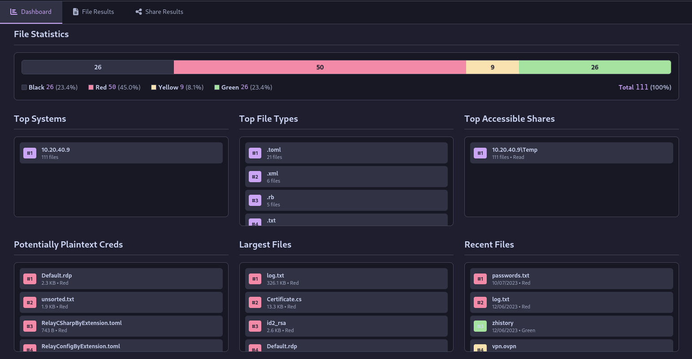
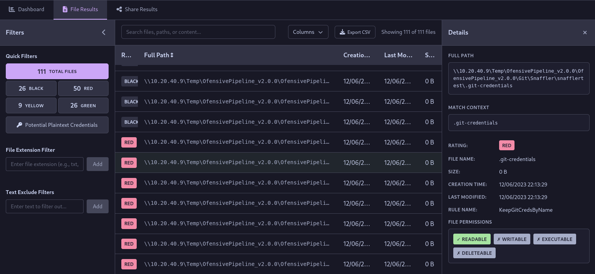

# 🧉 Chimas 

A web application to parse and analyse Snaffler output providing filtering capabilities in a nice interactive interface.  
Go checkout [Snaffler](https://github.com/SnaffCon/Snaffler)!

## Features

### Interactive Dashboard
- **Clickable Insights**: Navigate directly to filtered results from dashboard statistics
- **System & Share Filtering**: Quick access to specific systems or shares
- **File Extension Analysis**: Identify and filter by file types


### Results Table 
- **Details Panel**: Quick view of file contents and metadata without leaving the interface
- **Keyboard Navigation**: Use arrow keys to navigate through table rows
- **Filtering System**:
  - **Quick Filters**: Filter by severity rating (Red, Yellow, Green, Black)
  - **File Extension Filter**: Target specific file types for analysis
  - **Text Exclude Filter**: Remove unwanted results with custom text filters
  - **Search Functionality**: Find files, paths, or content quickly
- **Column Visibility**: Show/hide columns to focus on relevant data
- **CSV Export**: Export filtered results to CSV for external analysis


## Installation

1. **Clone the repository:**
```bash
git clone https://github.com/caueb/chimas.git
cd chimas
```

2. **Install dependencies:**
```bash
npm install
```

3. **Start the development server:**
```bash
npm run dev
```

4. **Open your browser** and navigate to [http://localhost:3000](http://localhost:3000)

# Disclaimer

This project was primarily generated with the assistance of AI tools and may contain code that has not been thoroughly reviewed or tested. It is not intended for use in production environments without proper validation, security review, and testing. Use at your own risk.
