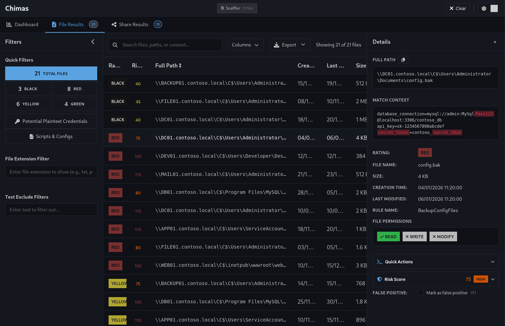
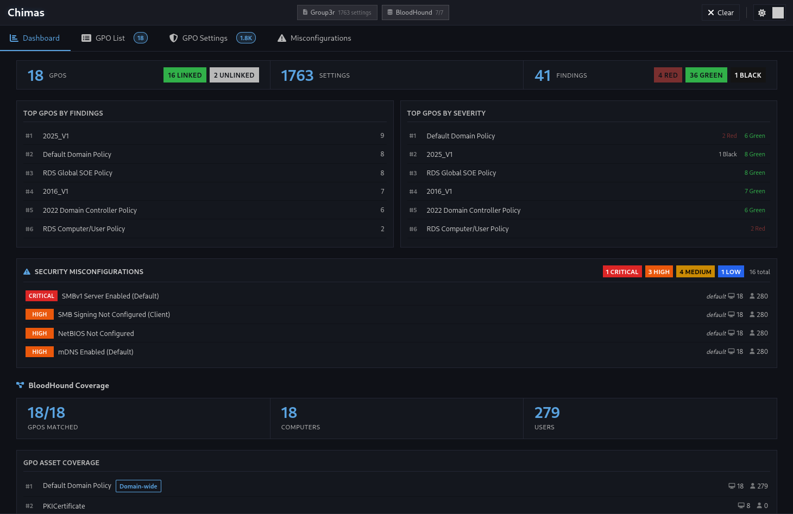

# Chimas

A web application for analysing [Snaffler](https://github.com/SnaffCon/Snaffler) and [Group3r](https://github.com/Group3r/Group3r) output with interactive filtering and BloodHound integration.

Also check out [group3r-python](https://github.com/caueb/group3r-python) — a Python port of Group3r for cross-platform use.

## Snaffler Analysis

- Dashboard with file rating distribution, risk scoring, and top findings
- Filterable results table with severity, file type, and keyword search
- Detail panel with match context highlighting and file metadata
- False positive marking (excluded from exports)
- Export to CSV / XLSX



## Group3r Analysis

- GPO inventory with settings, link status, and findings
- Security misconfiguration detection (SMB signing, LLMNR, IPv6, LDAP, cached credentials, etc.)
- BloodHound data integration to map GPOs to affected computers and users
- GPO precedence resolution for conflicting settings
- Unprotected asset identification per misconfiguration
- Export misconfigurations report to CSV / XLSX with affected asset lists


## Installation

```bash
git clone https://github.com/caueb/chimas.git
cd chimas
npm install
npm run dev
```

Open [http://localhost:3000](http://localhost:3000) in your browser.

## Snaffler Output

Chimas works best with Snaffler JSON output:

```powershell
Snaffler.exe -s -t JSON -o snaffler.json
```

If Snaffler crashes and leaves broken JSON (one object per line), repair with:

```bash
jq -s '{entries: .}' snaffler.json > snaffler-fixed.json
```

## Group3r + BloodHound Integration

After loading Group3r data, click **BloodHound** in the header to load BloodHound JSON exports. Required files: `gpos`, `ous`, `domains`, `computers`, `users`.

This enables:
- Per-GPO asset counts in the GPO List
- At-risk vs secured computer breakdown per misconfiguration
- GPO precedence conflict resolution
- Expandable computer lists with copy-to-clipboard

## Disclaimer

This project was primarily generated with the assistance of AI tools and may contain code that has not been thoroughly reviewed or tested. Use at your own risk.

## Credits
- Thanks to [perrc](https://github.com/perrc) for Group3r parsing support.
- [Snaffler](https://github.com/SnaffCon/Snaffler) — SMB share enumeration and file triage
- [Group3r](https://github.com/Group3r/Group3r) — Active Directory GPO auditing
- [BloodHound](https://github.com/BloodHoundAD/BloodHound) — AD relationship mapping

