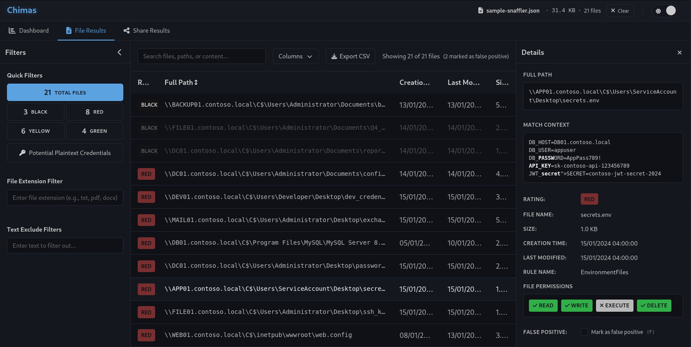

# Chimas 

A web application to parse and analyse Snaffler & Group3r (thanks [perrc](https://github.com/perrc)) output providing filtering capabilities in a nice interactive interface.  
Go checkout [Snaffler](https://github.com/SnaffCon/Snaffler)! *Chimas works best with Snaffler JSON output.*   
Go checkout [Group3r](https://github.com/Group3r/Group3r)!

## Features

### Interactive Dashboard
- **Clickable Insights**: Navigate directly to filtered results from dashboard statistics
- **System & Share Filtering**: Quick access to specific systems or shares
- **File Extension Analysis**: Identify and filter by file types


### Results Table 
- **Details Panel**: Quick view of file contents and metadata without leaving the interface
  - **Regex Highlighting**: Matched patterns are highlighted in the match context
  - **File Permissions**: Visual indicators for read, write, execute, and delete permissions
- **Keyboard Navigation**: Use arrow keys to navigate through table rows
- **False Positive Marking**: 
  - Mark files as false positives to exclude them from analysis
  - Press `F` to toggle false positive status on selected item
  - False positive items are automatically excluded from CSV exports
- **Filtering System**:
  - **Quick Filters**: Filter by severity rating (Red, Yellow, Green, Black)
  - **File Extension Filter**: Target specific file types for analysis
  - **Text Exclude Filter**: Remove unwanted results with custom text filters
  - **Search Functionality**: Find files, paths, or content quickly
- **Column Visibility**: Show/hide columns to focus on relevant data
- **CSV Export**: Export filtered results to CSV for external analysis (excludes false positives)


## Installation

1. **Clone the repository:**
```bash
git clone https://github.com/caueb/chimas.git
cd chimas
```

2. **Install dependencies:**
```bash
npm install
```

3. **Start the development server:**
```bash
npm run dev
```

4. **Open your browser** and navigate to [http://localhost:3000](http://localhost:3000)

## Last updates
### August 2025
- Drag-and-drop file upload
- Panel resizing, and unified export to CSV/XLSX are also added for all data views (these may need work for best presenting the GPO data).
- Added keyboard navigation to GPO table.
- Fixed fontawesome dependency.
- Include matchcontext in the file exports.
- Added GPO List view to Group3r analysis and more details in the selected setting.

### July 2025
- Export to XLSX

## Snaffler Output
Chimas currently supports Snaffler output in JSON & TXT/LOG format (but it works best with JSON). An example of how to generate Snaffler JSON output is shown below:
```powershell
Snaffler.exe -s -t JSON -o snaffler.json
```

Occasionally Snaffler may crash or terminate unexpectedly, leaving the JSON output in an invalid format. Instead of a single JSON object with an `"entries"` array, the file may contain one JSON object per line without commas or closing brackets.  
Example of broken output:
```json
{ "time": "2025-09-02 18:26:43.7248", "level": "foo", "message": "..." }
{ "time": "2025-09-02 18:27:43.7248", "level": "bar", "message": "..." }
```
Expected format:
```json
{ "entries": [
  { "time": "2025-09-02 18:26:43.7248", "level": "foo", "message": "..." },
  { "time": "2025-09-02 18:27:43.7248", "level": "foo", "message": "..." }
]}
```

You can repair the file with a simple bash one-liner:
```bash
(echo '{"entries":['; sed '$!s/$/,/' snaffler.json | tr -d '\r'; echo ']}' ) > fixed.json
```
This wraps the objects into a valid JSON array and adds commas between entries.  
Then you can load `fixed.json` into Chimas.


# Disclaimer

This project was primarily generated with the assistance of AI tools and may contain code that has not been thoroughly reviewed or tested. It is not intended for use in production environments without proper validation, security review, and testing. Use at your own risk.

# Credits
- Thanks to [perrc](https://github.com/perrc), chimas can now parse and display Group3r output.
